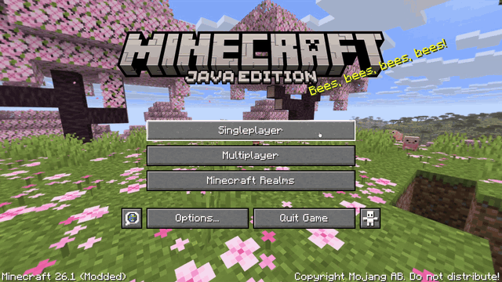

[日本語版はこちら / Japanese](#japanese)

# Version World Sorter (VWS)

A client-side Minecraft mod that hides save worlds which don't match your current Minecraft version from the world selection screen. Supports Fabric, Forge, and NeoForge.

This mod is a companion to [Version Mod Sorter (VMS)](../../../Version-Mod-Sorter). VMS lets you keep mods for many Minecraft versions in a single shared `mods` folder, which means every save world is also visible from every version. Opening a world with the wrong version can corrupt it. Version World Sorter prevents this by keeping worlds that don't fit the current version out of sight — you won't see them unless you deliberately switch the display mode. The two work well together, but either can also be used on its own.

## Requirements

- Minecraft 1.20.5+ (Forge is 1.20.6+, since Forge has no 1.20.5 release)
- Fabric Loader 0.15.0+ / Forge 50+ / NeoForge 20.5+
- A single jar works across all supported loaders and Minecraft versions — no need for separate builds.

## Installation

Download the latest `version-world-sorter-x.x.x.jar` from [Releases](../../releases) and place it in your `mods` folder. The same jar works with Fabric, Forge, and NeoForge.

If you also use Version Mod Sorter, placing the jar in `mods/<loader>/` (e.g. `mods/fabric/`) makes it apply to every Minecraft version through VMS's shared-mod mechanism.

## Usage

Open the world selection screen. A toggle button appears to the right of the search box. It cycles through three display modes each time you press it:

- **Exact** — shows only worlds that exactly match the current Minecraft version.
- **Compatible** — shows worlds at the current version or older, and hides worlds created in a newer version (which would be downgraded, the main corruption risk).
- **All** — shows every world, the same as vanilla.

On each launch, the mod picks the starting mode automatically: it tries `Exact`, then `Compatible`, then `All`, and starts with the first one that isn't empty. The toggle also skips any mode that would produce an empty list. This is to keep the list from ever becoming empty — if it did, vanilla would jump to the world-creation screen and the toggle button would no longer be reachable.

The selected mode is not saved; it resets on the next launch.

## How It Works

The mod polls `Minecraft.getInstance().screen` on a background thread and, when the world selection screen appears, filters the world list and installs the toggle button. It does not touch any Minecraft class as a type — screen detection and world-list access are done entirely through reflection — and it does not modify Minecraft classes or bytecode. This is why a single jar works across all loaders and versions. The "Compatible" mode reuses vanilla's own downgrade check to decide which worlds to hide.

## Notes

- This is a client-side mod and has no effect on servers.
- Hidden worlds are not deleted or altered in any way — they are only filtered out of the on-screen list. Switching to **All** brings them all back.
- The mod relies on internal Minecraft implementations accessed via reflection, so a major version update may cause it to stop working. In that case only this mod is affected; the game and your worlds are not touched.

## Support

Please report bugs and ask questions via [Issues](../../issues).

---

# Version World Sorter（VWS）

現在のMinecraftバージョンに合わないセーブを、ワールド選択画面から非表示にするクライアント専用MOD。Fabric・Forge・NeoForgeに対応しています。

このMODは [Version Mod Sorter（VMS）](../../../Version-Mod-Sorter) と組み合わせて使うことを想定しています。VMSは複数のMinecraftバージョン向けのMODを1つの共有 `mods` フォルダで管理できますが、その結果すべてのセーブがどのバージョンからも見えてしまいます。バージョンの合わないワールドを誤って開くと破損する恐れがあります。Version World Sorterは、現在のバージョンに合わないワールドを表示モードを切り替えない限り見えないようにすることで、この事故を抑制します。VMSと組み合わせると効果的ですが、どちらも単体でも使えます。

## 動作環境

- Minecraft 1.20.5 以降（ForgeのみMC 1.20.6以降。Forgeに1.20.5のリリースが存在しないため）
- Fabric Loader 0.15.0 以降 / Forge 50 以降 / NeoForge 20.5 以降
- 対応ローダーが動作するMinecraftのバージョンであれば、MCのバージョンごとに別のjarを用意する必要はありません。1つのjarで動作します。

## 導入

[Releases](../../releases)から最新の `version-world-sorter-x.x.x.jar` をダウンロードし、`mods` フォルダに入れます。同じjarをFabric・Forge・NeoForgeのいずれでもそのまま使えます。

Version Mod Sorterを併用している場合、jarを `mods/<ローダー>/`（例: `mods/fabric/`）に置くと、VMSの共有MOD機構によって全Minecraftバージョンに対して有効になります。

## 使い方

ワールド選択画面を開くと、検索ボックスの右隣にトグルボタンが表示されます。押すたびに、次の3つの表示モードを巡回します。

- **Exact（完全一致）** — 現在のMinecraftバージョンと完全に一致するワールドだけを表示します。
- **Compatible（互換）** — 現在のバージョン以下のワールドを表示し、より新しいバージョンで作成されたワールド（開くとダウングレードされ、破損の主な原因になる）を非表示にします。
- **All（全表示）** — すべてのワールドを表示します。vanillaと同じ挙動です。

起動するたびに、開始モードは自動で選ばれます。`Exact`→`Compatible`→`All` の順に試し、件数が0でない最初のモードから開始します。トグルボタンも、表示が0件になるモードは飛ばします。これは一覧を空にしないためです。一覧が空になると、vanillaが新規ワールド作成画面へ遷移し、トグルボタンにも到達できなくなります。

選択したモードは保存されず、次回起動時にリセットされます。

## 仕組み

バックグラウンドスレッドで `Minecraft.getInstance().screen` を監視し、ワールド選択画面が現れたらワールド一覧を絞り込み、トグルボタンを設置します。Minecraftのクラスを型として参照せず、画面検出もワールド一覧へのアクセスもすべてリフレクションで行います。Minecraftのクラスやバイトコードの書き換えにも一切触れていません。そのため1つのjarがどのローダー・バージョンでも動作します。「Compatible」モードは、どのワールドを隠すかの判定にvanilla自身のダウングレード判定を再利用しています。

## 注意点

- クライアント専用MODのため、サーバーには影響しません。
- 非表示にしたワールドは削除も変更もされません。画面上の一覧から除外しているだけです。**All** に切り替えればすべて元どおり表示されます。
- リフレクションでMinecraftの内部実装を利用しているため、大型アップデートで機能しなくなる場合があります。その場合も本MODが働かなくなるだけで、ゲーム本体やワールドへの影響はありません。

## 問い合わせ

不具合の報告や質問は [Issues](../../issues) からお願いします。
